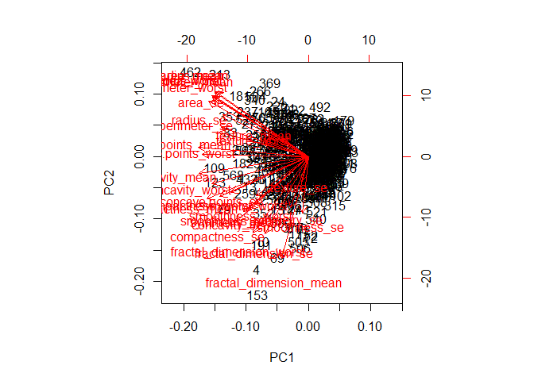

Class 10: Machine Learning Project
================
Tiffany Luong
2/7/2020

Recap from last week: tinyurl.com/BARRYMD kmeans(x, centers = \#)
hclust(dist(x)) PCA = prcomp(x, scale = T)

## Get our input data

Our data from today comes from the Breast Cancer Diagnostic Data Set:

``` r
# Save your input data file to a new 'data' directory

wisc.df <- read.csv("WisconsinCancer.csv")
head(wisc.df)
attributes(wisc.df)
```

We want numerical values only\!

``` r
wisc.data <- as.matrix(wisc.df[,3:32])
head(wisc.data)
```

> Q. How many patients are there in this dataset?

``` r
nrow(wisc.df)
```

    ## [1] 569

> Q. How many cancer and non-cancer patients are there?

``` r
sum(wisc.df$diagnosis == "M")
```

    ## [1] 212

``` r
table(wisc.df$diagnosis)
```

    ## 
    ##   B   M 
    ## 357 212

> Q. How many cols are "\_mean" values?

``` r
colnames(wisc.df)
```

We can use the `grep()` function combined with the `length` function to
see this:

``` r
length(grep("_mean", colnames(wisc.df), value = TRUE))
```

    ## [1] 10

## Enter Principal Component Analysis

First we need to check whether our input data should be scaled.

For apply row = 1, column = 2.

Let’s check the sd() and mean() of all our columns in `wisc.data`.

To make the \#’s more legible, use `round` round(x, \#sig figs).

``` r
round(apply(wisc.data, 2, sd), 2)

round(apply(wisc.data, 2, mean), 2)
```

``` r
#Perform PCA on wisc.data by completing the following code
wisc.pr <- prcomp(wisc.data, scale = TRUE)
summary(wisc.pr)
```

> Q7. From your results, what proportion of the original variance is
> captured by the first principal components (PC1)? 44.27 Q8. How many
> principal components (PCs) are required to describe at least 70% of
> the original variance in the data? 3 Q9. How many principal components
> (PCs) are required to describe at least 90% of the original variance
> in the data? 7

``` r
biplot(wisc.pr)
```

<!-- -->

This is a hot mess\! We need to cook our own PCA plot.

``` r
attributes(wisc.pr)
```

    ## $names
    ## [1] "sdev"     "rotation" "center"   "scale"    "x"       
    ## 
    ## $class
    ## [1] "prcomp"

We want the $x component to make the plot\!

The same thing would be plot(wisc.pr\(x[,1], wisc.pr\)x\[,2\],
col=wisc.df$diagnosis).

``` r
plot(wisc.pr$x[,1:2], col=wisc.df$diagnosis)
```

<!-- -->

Wow, this looks cool\! There is a seperation of the red (cancer) from
black (non-cancer) samples.

## Hierarchical clustering

Can we find a seperation of cancer from non-cancer using a clustering
method on the original input data?

For this we will use the `hclust()` function on the `wisc.data` object
that we used for PCA.

Now let’s cluster it:

``` r
#Create a hierarchical clustering model using complete linkage. Manually specify the method argument to hclust() and assign the results to wisc.hclust.

wisc.hc <- hclust(dist(wisc.data), method = "complete")

plot(wisc.hc)
```

<!-- -->

Where are you supposed to *cut* a tree like this???

``` r
wisc.hc.cut <- cutree(wisc.hc, k = 4)

table(wisc.hc.cut, wisc.df$diagnosis)
```

    ##            
    ## wisc.hc.cut   B   M
    ##           1   1 110
    ##           2 356  82
    ##           3   0  19
    ##           4   0   1

But this division doesn’t seem correct…

I can cluster in PC space - in other words, use the results of PCA to
cluster\!

``` r
wist.pr.hc <- hclust(dist(wisc.pr$x[,1:3]), method="ward.D2")
plot(wist.pr.hc)
```

<!-- -->

``` r
grps <- cutree(wist.pr.hc, k =2)
table(grps)
```

    ## grps
    ##   1   2 
    ## 203 366

``` r
table(grps, wisc.df$diagnosis)
```

    ##     
    ## grps   B   M
    ##    1  24 179
    ##    2 333  33

``` r
plot(wisc.pr$x[,1], wisc.pr$x[,2], col=grps)
```

<!-- -->

## Prediction using our PCA model

We will use the `predict()` function that will take our PCA model from
before and new cancer cell data and project that data onto our PCA
space.

``` r
url <- "https://tinyurl.com/new-samples-CSV"
new <- read.csv(url)
npc <- predict(wisc.pr, newdata=new)
npc
```

``` r
plot(wisc.pr$x[,1], wisc.pr$x[,2], col=wisc.df$diagnosis)
points(npc[,1], npc[,2], col="blue", pch=16, cex=3)
text(npc[,1], npc[,2], labels=c(1,2), col="white")
```

<!-- -->
