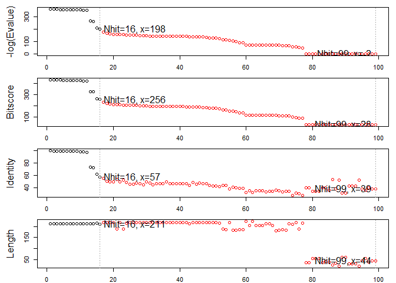

Structural Bioinformatics (pt.1)
================

## Don’t forget the GitHub workflow\!

> ADD the file to the stage. COMMIT the file. PUSH the file to GitHub.

## PDB Statistics

Download a CSV file from the PDB site (accessible from “Analyze” \> “PDB
Statistics” \> “by Experimental Method and Molecular Type”). Move this
CSV file into your RStudio project and use it to answer the following
questions.

> Q1. What percentage of structures in the PDB are solved by X-Ray and
> Electron microscope?

``` r
stats <- read.csv("Data_Export_Summary.csv", row.names = 1)

print(stats)
```

    ##                     Proteins Nucleic.Acids Protein.NA.Complex Other  Total
    ## X-Ray                 133756          2086               6884     8 142734
    ## NMR                    11308          1317                265     8  12898
    ## Electron Microscopy     3241            35               1095     0   4371
    ## Other                    284             4                  6    13    307
    ## Multi Method             146             5                  2     1    154

``` r
sum(stats$Total)
```

    ## [1] 160464

``` r
ans1 <- round(stats$Total/sum(stats$Total)*100, 2)

names(ans1) <- rownames(stats)

ans1
```

    ##               X-Ray                 NMR Electron Microscopy               Other 
    ##               88.95                8.04                2.72                0.19 
    ##        Multi Method 
    ##                0.10

> Q2. What proportion of sturctures in the PDB are protein?

``` r
ans2 <- round(sum(stats$Proteins)/sum(stats$Total)*100, 2)

ans2
```

    ## [1] 92.69

> Q3. Q: Type HIV in the PDB website search box on the home page and
> determine how many HIV-1 protease structures are in the current PDB?
> 1282\! That’s a lot…

## 2\. USing bio3d to analyze protein structure data

Use the bio3d package from CRAN. We should already have this downloaded
from the previous homework.

``` r
library(bio3d)

pdb <- read.pdb("1hsg")
```

    ##   Note: Accessing on-line PDB file

``` r
pdb
```

    ## 
    ##  Call:  read.pdb(file = "1hsg")
    ## 
    ##    Total Models#: 1
    ##      Total Atoms#: 1686,  XYZs#: 5058  Chains#: 2  (values: A B)
    ## 
    ##      Protein Atoms#: 1514  (residues/Calpha atoms#: 198)
    ##      Nucleic acid Atoms#: 0  (residues/phosphate atoms#: 0)
    ## 
    ##      Non-protein/nucleic Atoms#: 172  (residues: 128)
    ##      Non-protein/nucleic resid values: [ HOH (127), MK1 (1) ]
    ## 
    ##    Protein sequence:
    ##       PQITLWQRPLVTIKIGGQLKEALLDTGADDTVLEEMSLPGRWKPKMIGGIGGFIKVRQYD
    ##       QILIEICGHKAIGTVLVGPTPVNIIGRNLLTQIGCTLNFPQITLWQRPLVTIKIGGQLKE
    ##       ALLDTGADDTVLEEMSLPGRWKPKMIGGIGGFIKVRQYDQILIEICGHKAIGTVLVGPTP
    ##       VNIIGRNLLTQIGCTLNF
    ## 
    ## + attr: atom, xyz, seqres, helix, sheet,
    ##         calpha, remark, call

> Q: How many amino acid residues are there in this pdb object? 198

> Q: Name one of the two non-protein residues? MK1

> Q: How many protein chains are in this structure? 2 (A and B)

You can access this information from `attributes(pdb)`.

## Comparative structure analysis of Adenylate Kinase

On PDB it’s 1AKE.

Installing packages: Make sure that you run the install in the R console
and not the R markdown document to avoid trying to install packages (and
wasting your time\!) every single time you knit. The packages we
install: “bio3d” “ggplot2” “ggrepel” “devtools” “BiocManager” As part of
the BioConductor repository, “BiocManager::install(”msa“)”
“devtools::install\_bitbucket(”Grantlab/bio3d-view“)”.

These packages will be useful for looking at biomolecular data.

You could also (if desired) go through GitHub:
`devtools::instal_github()`

> 1.  Search and retrieve ADK structures.

``` r
library(bio3d)

aa <- get.seq("1ake_A")
```

    ## Warning in get.seq("1ake_A"): Removing existing file: seqs.fasta

    ## Fetching... Please wait. Done.

``` r
aa
```

    ##              1        .         .         .         .         .         60 
    ## pdb|1AKE|A   MRIILLGAPGAGKGTQAQFIMEKYGIPQISTGDMLRAAVKSGSELGKQAKDIMDAGKLVT
    ##              1        .         .         .         .         .         60 
    ## 
    ##             61        .         .         .         .         .         120 
    ## pdb|1AKE|A   DELVIALVKERIAQEDCRNGFLLDGFPRTIPQADAMKEAGINVDYVLEFDVPDELIVDRI
    ##             61        .         .         .         .         .         120 
    ## 
    ##            121        .         .         .         .         .         180 
    ## pdb|1AKE|A   VGRRVHAPSGRVYHVKFNPPKVEGKDDVTGEELTTRKDDQEETVRKRLVEYHQMTAPLIG
    ##            121        .         .         .         .         .         180 
    ## 
    ##            181        .         .         .   214 
    ## pdb|1AKE|A   YYSKEAEAGNTKYAKVDGTKPVAEVRADLEKILG
    ##            181        .         .         .   214 
    ## 
    ## Call:
    ##   read.fasta(file = outfile)
    ## 
    ## Class:
    ##   fasta
    ## 
    ## Alignment dimensions:
    ##   1 sequence rows; 214 position columns (214 non-gap, 0 gap) 
    ## 
    ## + attr: id, ali, call

> Q. How many amino acids are in this sequence, i.e. how long is this
> sequence? 214

Now we can use this sequence to do a BLAST search on the PDB to find a
similiar sequence and structure.

``` r
#Blast or hmmer search.
b <- blast.pdb(aa)
```

    ##  Searching ... please wait (updates every 5 seconds) RID = 4GKFZ4D001R 
    ##  .
    ##  Reporting 99 hits

Visualize this:

``` r
#Plot a summary of search results
hits <- plot(b)
```

    ##   * Possible cutoff values:    197 -3 
    ##             Yielding Nhits:    16 99 
    ## 
    ##   * Chosen cutoff value of:    197 
    ##             Yielding Nhits:    16

<!-- -->

This is horrible to look at. Let’s visualize and filter them through
`plot.blast()`. Let’s make top scoring hits in black.

``` r
#List out some 'top hits'
head(hits$pdb.id, 16)
```

    ##  [1] "1AKE_A" "4X8M_A" "6S36_A" "6RZE_A" "4X8H_A" "3HPR_A" "1E4V_A" "5EJE_A"
    ##  [9] "1E4Y_A" "3X2S_A" "6HAP_A" "6HAM_A" "4K46_A" "4NP6_A" "3GMT_A" "4PZL_A"

Great\! We see 1AKE\_A there (our target query) for a total of 16 hits.

``` r
hits <- NULL
hits$pdb.id <- c("1AKE_A", "4X8M_A", "6S36_A", "6RZE_A", "4X8H_A", "3HPR_A", "1E4V_A", "5EJE_A", "1E4Y_A", "3X2S_A", "6HAP_A", "6HAM_A", "4K46_A", "4NP6_A", "3GMT_A", "4PZL_A")
```

``` r
hits$pdb.id
```

    ##  [1] "1AKE_A" "4X8M_A" "6S36_A" "6RZE_A" "4X8H_A" "3HPR_A" "1E4V_A" "5EJE_A"
    ##  [9] "1E4Y_A" "3X2S_A" "6HAP_A" "6HAM_A" "4K46_A" "4NP6_A" "3GMT_A" "4PZL_A"

Download and parse the structures:

``` r
#Download related PDB files
files <- get.pdb(hits$pdb.id, path="pdbs", split=TRUE, gzip=TRUE)
```

    ## Warning in get.pdb(hits$pdb.id, path = "pdbs", split = TRUE, gzip = TRUE): pdbs/
    ## 1AKE.pdb exists. Skipping download

    ## Warning in get.pdb(hits$pdb.id, path = "pdbs", split = TRUE, gzip = TRUE): pdbs/
    ## 4X8M.pdb exists. Skipping download

    ## Warning in get.pdb(hits$pdb.id, path = "pdbs", split = TRUE, gzip = TRUE): pdbs/
    ## 6S36.pdb exists. Skipping download

    ## Warning in get.pdb(hits$pdb.id, path = "pdbs", split = TRUE, gzip = TRUE): pdbs/
    ## 6RZE.pdb exists. Skipping download

    ## Warning in get.pdb(hits$pdb.id, path = "pdbs", split = TRUE, gzip = TRUE): pdbs/
    ## 4X8H.pdb exists. Skipping download

    ## Warning in get.pdb(hits$pdb.id, path = "pdbs", split = TRUE, gzip = TRUE): pdbs/
    ## 3HPR.pdb exists. Skipping download

    ## Warning in get.pdb(hits$pdb.id, path = "pdbs", split = TRUE, gzip = TRUE): pdbs/
    ## 1E4V.pdb exists. Skipping download

    ## Warning in get.pdb(hits$pdb.id, path = "pdbs", split = TRUE, gzip = TRUE): pdbs/
    ## 5EJE.pdb exists. Skipping download

    ## Warning in get.pdb(hits$pdb.id, path = "pdbs", split = TRUE, gzip = TRUE): pdbs/
    ## 1E4Y.pdb exists. Skipping download

    ## Warning in get.pdb(hits$pdb.id, path = "pdbs", split = TRUE, gzip = TRUE): pdbs/
    ## 3X2S.pdb exists. Skipping download

    ## Warning in get.pdb(hits$pdb.id, path = "pdbs", split = TRUE, gzip = TRUE): pdbs/
    ## 6HAP.pdb exists. Skipping download

    ## Warning in get.pdb(hits$pdb.id, path = "pdbs", split = TRUE, gzip = TRUE): pdbs/
    ## 6HAM.pdb exists. Skipping download

    ## Warning in get.pdb(hits$pdb.id, path = "pdbs", split = TRUE, gzip = TRUE): pdbs/
    ## 4K46.pdb exists. Skipping download

    ## Warning in get.pdb(hits$pdb.id, path = "pdbs", split = TRUE, gzip = TRUE): pdbs/
    ## 4NP6.pdb exists. Skipping download

    ## Warning in get.pdb(hits$pdb.id, path = "pdbs", split = TRUE, gzip = TRUE): pdbs/
    ## 3GMT.pdb exists. Skipping download

    ## Warning in get.pdb(hits$pdb.id, path = "pdbs", split = TRUE, gzip = TRUE): pdbs/
    ## 4PZL.pdb exists. Skipping download

    ##   |                                                                              |                                                                      |   0%  |                                                                              |====                                                                  |   6%  |                                                                              |=========                                                             |  12%  |                                                                              |=============                                                         |  19%  |                                                                              |==================                                                    |  25%  |                                                                              |======================                                                |  31%  |                                                                              |==========================                                            |  38%  |                                                                              |===============================                                       |  44%  |                                                                              |===================================                                   |  50%  |                                                                              |=======================================                               |  56%  |                                                                              |============================================                          |  62%  |                                                                              |================================================                      |  69%  |                                                                              |====================================================                  |  75%  |                                                                              |=========================================================             |  81%  |                                                                              |=============================================================         |  88%  |                                                                              |==================================================================    |  94%  |                                                                              |======================================================================| 100%

Now that we have the structures, we can use `pdbaln()` function to align
and optimally fit (superpose) the identified PDB structures.

``` r
#Align related PDBs, we will only take "A" from each file!
pdbs <- pdbaln(files, fit = TRUE, exefile = "msa")
```

    ## Reading PDB files:
    ## pdbs/split_chain/1AKE_A.pdb
    ## pdbs/split_chain/4X8M_A.pdb
    ## pdbs/split_chain/6S36_A.pdb
    ## pdbs/split_chain/6RZE_A.pdb
    ## pdbs/split_chain/4X8H_A.pdb
    ## pdbs/split_chain/3HPR_A.pdb
    ## pdbs/split_chain/1E4V_A.pdb
    ## pdbs/split_chain/5EJE_A.pdb
    ## pdbs/split_chain/1E4Y_A.pdb
    ## pdbs/split_chain/3X2S_A.pdb
    ## pdbs/split_chain/6HAP_A.pdb
    ## pdbs/split_chain/6HAM_A.pdb
    ## pdbs/split_chain/4K46_A.pdb
    ## pdbs/split_chain/4NP6_A.pdb
    ## pdbs/split_chain/3GMT_A.pdb
    ## pdbs/split_chain/4PZL_A.pdb
    ##    PDB has ALT records, taking A only, rm.alt=TRUE
    ## ..   PDB has ALT records, taking A only, rm.alt=TRUE
    ## .   PDB has ALT records, taking A only, rm.alt=TRUE
    ## ..   PDB has ALT records, taking A only, rm.alt=TRUE
    ## ..   PDB has ALT records, taking A only, rm.alt=TRUE
    ## ....   PDB has ALT records, taking A only, rm.alt=TRUE
    ## .   PDB has ALT records, taking A only, rm.alt=TRUE
    ## ....
    ## 
    ## Extracting sequences
    ## 
    ## pdb/seq: 1   name: pdbs/split_chain/1AKE_A.pdb 
    ##    PDB has ALT records, taking A only, rm.alt=TRUE
    ## pdb/seq: 2   name: pdbs/split_chain/4X8M_A.pdb 
    ## pdb/seq: 3   name: pdbs/split_chain/6S36_A.pdb 
    ##    PDB has ALT records, taking A only, rm.alt=TRUE
    ## pdb/seq: 4   name: pdbs/split_chain/6RZE_A.pdb 
    ##    PDB has ALT records, taking A only, rm.alt=TRUE
    ## pdb/seq: 5   name: pdbs/split_chain/4X8H_A.pdb 
    ## pdb/seq: 6   name: pdbs/split_chain/3HPR_A.pdb 
    ##    PDB has ALT records, taking A only, rm.alt=TRUE
    ## pdb/seq: 7   name: pdbs/split_chain/1E4V_A.pdb 
    ## pdb/seq: 8   name: pdbs/split_chain/5EJE_A.pdb 
    ##    PDB has ALT records, taking A only, rm.alt=TRUE
    ## pdb/seq: 9   name: pdbs/split_chain/1E4Y_A.pdb 
    ## pdb/seq: 10   name: pdbs/split_chain/3X2S_A.pdb 
    ## pdb/seq: 11   name: pdbs/split_chain/6HAP_A.pdb 
    ## pdb/seq: 12   name: pdbs/split_chain/6HAM_A.pdb 
    ##    PDB has ALT records, taking A only, rm.alt=TRUE
    ## pdb/seq: 13   name: pdbs/split_chain/4K46_A.pdb 
    ##    PDB has ALT records, taking A only, rm.alt=TRUE
    ## pdb/seq: 14   name: pdbs/split_chain/4NP6_A.pdb 
    ## pdb/seq: 15   name: pdbs/split_chain/3GMT_A.pdb 
    ## pdb/seq: 16   name: pdbs/split_chain/4PZL_A.pdb

Now let’s label and draw the schematic for how we want to label and plot
the structures.

``` r
#Vector containing PDB codes for the figure axis.
ids <- basename.pdb(pdbs$id)

#Draw the schematic alignment
plot(pdbs, labels=ids)
```

<!-- --> Figure 2:
The grey regions are aligned residues, while white depicts gap regions.
The red bar depicts sequence conservation.

Note\!\!\! If you get the error message “Error in plot.new() : figure
margins too large.” that means your R Studio window is too small… Simply
resize your window and run the plot again. :) Yay\!

## View the superposed structures\!

We can use the new `bio3d.view()` function:

\*Don’t know why `rgl` was missing, but install it\!

``` r
library(bio3d.view)
library(rgl)

view(pdbs)
```

Figure 3: 3D view of superposed ADK structures from PDB.

Finally, we can annotate this.

The function `pdb.annotate()` to annotate the PDB files we have
collected. Here we will annotate each structure to its source species.
This will be helpful for plots later on.

``` r
anno <- pdb.annotate(ids)
```

    ## Warning in pdb.annotate(ids): ids should be standard 4 character PDB-IDs: trying
    ## first 4 characters...

``` r
unique(anno$source)
```

    ## [1] "Escherichia coli"          "Photobacterium profundum" 
    ## [3] "Vibrio cholerae"           "Burkholderia pseudomallei"
    ## [5] "Francisella tularensis"

## Principal component analysis

The function `pca()` provides a PCA of the structure data. This is a
statistical approach used to transform a data set down to a few
important components that describes the directions where there is most
variance. In terms of protein structures PCA is used to capture the
major structural variations within an ensemble of structures\!

``` r
pc <- pca(pdbs)
plot(pc)
```

<!-- --> Figure 4:
Results of PCA on Adenylate kinase X-ray structures. Each dot is a
single PDB structure.

> THE IMPORTANT TAKEAWAY: Look at how much we’ve reduced the 612
> original variables (PC1-612\!) down to just PC1 that explains 84.4% of
> the variance\! The more PCs we look at, the less those plots explain
> the variances between the data set.

Now that we have this super easy to visualize data (haha no I’m so
confused), the function `rmsd()` will calculate all the pairwise RMSD
values of the structural ensemble. This facilitates clustering analysis
based on the pairwise structural deviation:

``` r
#Calculate RMSD
rd <- rmsd(pdbs)
```

    ## Warning in rmsd(pdbs): No indices provided, using the 204 non NA positions

``` r
#Structure-based clustering
hc.rd <- hclust(dist(rd))
grps.rd <- cutree(hc.rd, k=3)

plot(pc, 1:2, col="grey50", bg=grps.rd, pch=21, cex=1)
```

<!-- --> Figure 5:
Projection of Adenylate kinase X-ray structures. Each dot is a PDB
structure.

The plot shows a conformer plot – a low-dimensional representation of
the conformational variability within the ensemble of PDB structures.
The plot is obtained by projecting the individual structures onto two
selected PCs (e.g. PC-1 and PC-2). These projections display the
inter-conformer relationship in terms of the conformational differences
described by the selected PCs.

Make a PCA trajectory.

To visualize the major structural variations in the ensemble the
function `mktrj()` (make trajectory) can be used to generate a
trajectory PDB file by interpolating along a give PC (eigenvector):

``` r
#Visualize the first principal component
pc1 <- mktrj(pc, pc=1, file="pc_1.pdb")
```

``` r
view(pc1)
```

    ## Potential all C-alpha atom structure(s) detected: Using calpha.connectivity()

Figure 6: Visualization of PC-1 trajectory.

## ggplot2

Let’s try to just toss this onto ggplot2:

``` r
#Plotting results with ggplot2
library(ggplot2)
library(ggrepel)

df <- data.frame(x=pc$z[,1], y=pc$z[,2])
col <- as.factor(grps.rd)

p <- ggplot(df, aes(x, y)) +
 geom_point(aes(col=col), size=2) +
 xlab("PC1") +
 ylab("PC2") +
 scale_color_discrete(name="Clusters") +
 geom_text_repel(aes(label=ids))
p
```

<!-- -->
