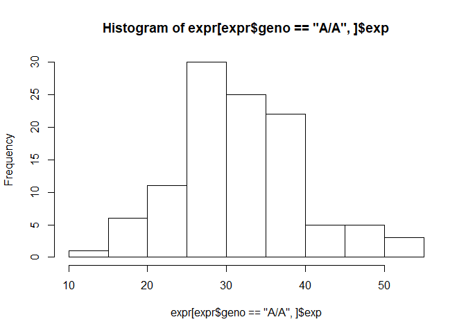
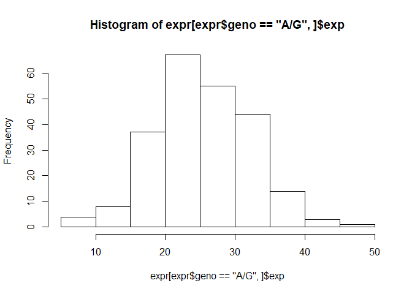
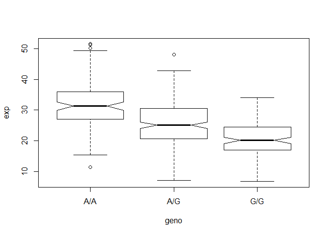
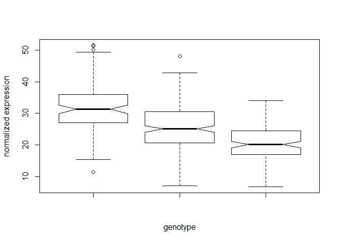

GALAXY and RNA-Seq Analysis
================

# GALAXY

Mostly refer to the in-class lab worksheet for the GALAXY portion of
this class.

> > Workflow: FASTQ -\> Quality Control (FASTQC) -\> MAPPING (Tophat)
> > -\> COUNT (Cufflinks)

# Genotype Analysis

We downloaded this genotype information from ENSMBL.

``` r
mxl <- read.csv("373531-SampleGenotypes-Homo_sapiens_Variation_Sample_rs8067378.csv")

head(mxl)
```

    ##   Sample..Male.Female.Unknown. Genotype..forward.strand. Population.s. Father
    ## 1                  NA19648 (F)                       A|A ALL, AMR, MXL      -
    ## 2                  NA19649 (M)                       G|G ALL, AMR, MXL      -
    ## 3                  NA19651 (F)                       A|A ALL, AMR, MXL      -
    ## 4                  NA19652 (M)                       G|G ALL, AMR, MXL      -
    ## 5                  NA19654 (F)                       G|G ALL, AMR, MXL      -
    ## 6                  NA19655 (M)                       A|G ALL, AMR, MXL      -
    ##   Mother
    ## 1      -
    ## 2      -
    ## 3      -
    ## 4      -
    ## 5      -
    ## 6      -

We want to look at the column that contains the genotype information.

``` r
table(mxl$Genotype..forward.strand.)
```

    ## 
    ## A|A A|G G|A G|G 
    ##  22  21  12   9

## RNA-Seq result analysis for different genotypes of this SNP

``` r
expr <- read.table("rs8067378_ENSG00000172057.6.txt")

head(expr)
```

    ##    sample geno      exp
    ## 1 HG00367  A/G 28.96038
    ## 2 NA20768  A/G 20.24449
    ## 3 HG00361  A/A 31.32628
    ## 4 HG00135  A/A 34.11169
    ## 5 NA18870  G/G 18.25141
    ## 6 NA11993  A/A 32.89721

Does the expression change with the phenotype?

Compile the data so that you only see the individual genotypes (A/A,
A/G, G/G).

``` r
summary(expr[expr$geno == "A/A",]$exp)
```

    ##    Min. 1st Qu.  Median    Mean 3rd Qu.    Max. 
    ##   11.40   27.02   31.25   31.82   35.92   51.52

``` r
summary(expr[expr$geno == "A/G",]$exp)
```

    ##    Min. 1st Qu.  Median    Mean 3rd Qu.    Max. 
    ##   7.075  20.626  25.065  25.397  30.552  48.034

``` r
summary(expr[expr$geno == "G/G",]$exp)
```

    ##    Min. 1st Qu.  Median    Mean 3rd Qu.    Max. 
    ##   6.675  16.903  20.074  20.594  24.457  33.956

``` r
hist(expr[expr$geno == "A/A",]$exp)
```

<!-- -->

``` r
hist(expr[expr$geno == "A/G",]$exp)
```

<!-- -->

``` r
hist(expr[expr$geno == "G/G",]$exp)
```

<!-- -->

## Try a boxplot\!

We will use a `boxplot` function and the input data will be **expr**.
How do we draw a useful plot?

`notch` is a very useful boxplot argument that will help you determine
whether your data has any significance\!

``` r
boxplot(exp ~ geno, data=expr, notch = TRUE)
```

<!-- -->

``` r
boxplot(expr[expr$geno == "A/A",]$exp, expr[expr$geno == "A/G",]$exp, expr[expr$geno == "G/G",]$exp, ylab = "normalized expression", xlab = "genotype", notch = TRUE)
```

<!-- -->
