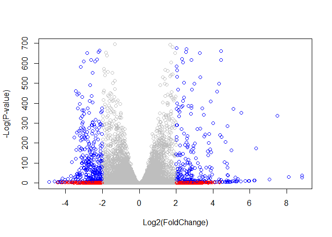
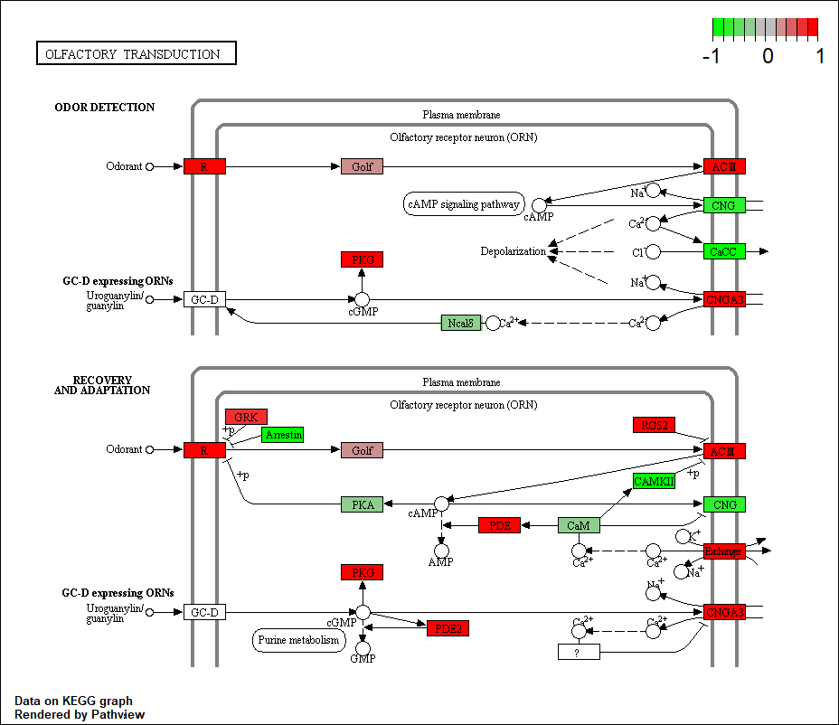
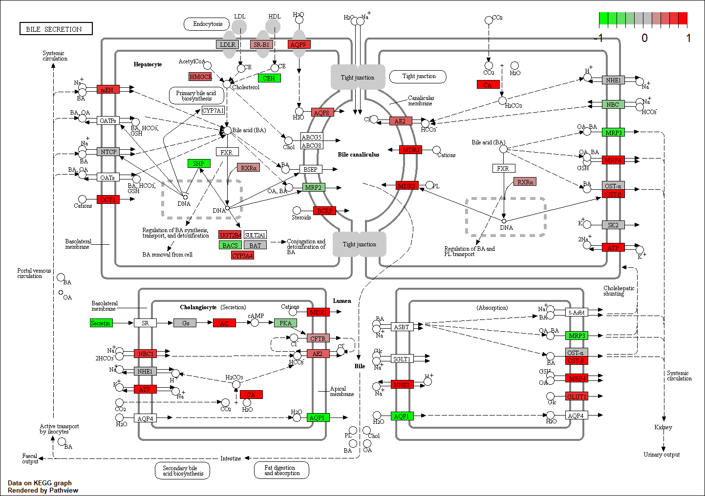

Class 16: Pathway Analysis from RNA-Seq Results
================

> > Live code: See the live code version here
> > <https://tinyurl.com/class16-bggn213>

## 1\. Differential Expression Analysis

Let’s setup our R Studio with the program and the files that we’ll be
analyzing today.

> > Download and read input data

The data for for hands-on session comes from GEO entry: GSE37704, which
is associated with the following publication:

Trapnell C, Hendrickson DG, Sauvageau M, Goff L et al. “Differential
analysis of gene regulation at transcript resolution with RNA-seq”. Nat
Biotechnol 2013 Jan;31(1):46-53. PMID: 23222703 The authors report on
differential analysis of lung fibroblasts in response to loss of the
developmental transcription factor HOXA1.

``` r
metaFile <- "GSE37704_metadata.csv"
countFile <- "GSE37704_featurecounts.csv"

# Import metadata and take a peak

colData = read.csv(metaFile, row.names=1)
head(colData)
```

    ##               condition
    ## SRR493366 control_sirna
    ## SRR493367 control_sirna
    ## SRR493368 control_sirna
    ## SRR493369      hoxa1_kd
    ## SRR493370      hoxa1_kd
    ## SRR493371      hoxa1_kd

``` r
# Import countdata
rawcountData = read.csv(countFile, row.names=1)
head(rawcountData)
```

    ##                 length SRR493366 SRR493367 SRR493368 SRR493369 SRR493370
    ## ENSG00000186092    918         0         0         0         0         0
    ## ENSG00000279928    718         0         0         0         0         0
    ## ENSG00000279457   1982        23        28        29        29        28
    ## ENSG00000278566    939         0         0         0         0         0
    ## ENSG00000273547    939         0         0         0         0         0
    ## ENSG00000187634   3214       124       123       205       207       212
    ##                 SRR493371
    ## ENSG00000186092         0
    ## ENSG00000279928         0
    ## ENSG00000279457        46
    ## ENSG00000278566         0
    ## ENSG00000273547         0
    ## ENSG00000187634       258

``` r
# Note we need to remove the odd first $length col
countData <- as.matrix(rawcountData[,-1])
head(countData)
```

    ##                 SRR493366 SRR493367 SRR493368 SRR493369 SRR493370 SRR493371
    ## ENSG00000186092         0         0         0         0         0         0
    ## ENSG00000279928         0         0         0         0         0         0
    ## ENSG00000279457        23        28        29        29        28        46
    ## ENSG00000278566         0         0         0         0         0         0
    ## ENSG00000273547         0         0         0         0         0         0
    ## ENSG00000187634       124       123       205       207       212       258

``` r
dim(countData)
```

    ## [1] 19808     6

``` r
# This tells you nrow + ncol as a single function.
```

There are genes that have zero counts in all samples (i.e. columns). We
should remove these.

First, to identify these columns we can use `rowsum`.

Exclude these zero sum rows.

``` r
validcountData <- countData[ rowSums(countData) != 0 , ]
head(validcountData)
```

    ##                 SRR493366 SRR493367 SRR493368 SRR493369 SRR493370 SRR493371
    ## ENSG00000279457        23        28        29        29        28        46
    ## ENSG00000187634       124       123       205       207       212       258
    ## ENSG00000188976      1637      1831      2383      1226      1326      1504
    ## ENSG00000187961       120       153       180       236       255       357
    ## ENSG00000187583        24        48        65        44        48        64
    ## ENSG00000187642         4         9        16        14        16        16

``` r
dim(validcountData)
```

    ## [1] 15975     6

## 2\. Running DESeq2

``` r
library(BiocVersion)
```

``` r
dds = DESeqDataSetFromMatrix(countData=countData,
                             colData=colData,
                             design=~condition)
dds = DESeq(dds)
```

    ## estimating size factors

    ## estimating dispersions

    ## gene-wise dispersion estimates

    ## mean-dispersion relationship

    ## final dispersion estimates

    ## fitting model and testing

``` r
dds
```

    ## class: DESeqDataSet 
    ## dim: 19808 6 
    ## metadata(1): version
    ## assays(4): counts mu H cooks
    ## rownames(19808): ENSG00000186092 ENSG00000279928 ... ENSG00000277475
    ##   ENSG00000268674
    ## rowData names(22): baseMean baseVar ... deviance maxCooks
    ## colnames(6): SRR493366 SRR493367 ... SRR493370 SRR493371
    ## colData names(2): condition sizeFactor

``` r
res = results(dds)
```

``` r
summary(res)
```

    ## 
    ## out of 15975 with nonzero total read count
    ## adjusted p-value < 0.1
    ## LFC > 0 (up)       : 4349, 27%
    ## LFC < 0 (down)     : 4393, 27%
    ## outliers [1]       : 0, 0%
    ## low counts [2]     : 1221, 7.6%
    ## (mean count < 0)
    ## [1] see 'cooksCutoff' argument of ?results
    ## [2] see 'independentFiltering' argument of ?results

Derp derp derp, the plot looks like a volcano plot because it’s a
scatterplot. Volcano isn’t *actually* a type of plot. It’s a scatter
plot that looks like a volcano ayyyy.

You take the -log in order to be able to visualize your p-value.

``` r
plot( res$log2FoldChange, -log(res$padj) )
```

<!-- -->

``` r
# Make a color vector for all genes
mycols <- rep("gray", nrow(res) )

# Color red the genes with absolute fold change above 2
mycols[ abs(res$log2FoldChange) > 2 ] <- "red"

# Color blue those with adjusted p-value less than 0.01
#  and absolute fold change more than 2
inds <- ((res$padj < 0.01) & (abs(res$log2FoldChange) > 2 ))
mycols[ inds ] <- "blue"

plot( res$log2FoldChange, -log(res$padj), col= mycols, xlab="Log2(FoldChange)", ylab="-Log(P-value)" )
```

<!-- -->

## 3\. Annotate your genes.

To add annotation to the gene list, install some bioconductor packages.
However, I DO NOT DO THIS IN MY document I install them in the
CONSOLE\!\!\!

Let’s map our ENSEMBLE gene ids to the more conventional gene SYMBOL.

``` r
# BiocManager::install("AnnotationDbi")
# BiocManager::install("org.Hs.eg.db")
library("AnnotationDbi")
library("org.Hs.eg.db")
```

    ## 

``` r
columns(org.Hs.eg.db)
```

    ##  [1] "ACCNUM"       "ALIAS"        "ENSEMBL"      "ENSEMBLPROT"  "ENSEMBLTRANS"
    ##  [6] "ENTREZID"     "ENZYME"       "EVIDENCE"     "EVIDENCEALL"  "GENENAME"    
    ## [11] "GO"           "GOALL"        "IPI"          "MAP"          "OMIM"        
    ## [16] "ONTOLOGY"     "ONTOLOGYALL"  "PATH"         "PFAM"         "PMID"        
    ## [21] "PROSITE"      "REFSEQ"       "SYMBOL"       "UCSCKG"       "UNIGENE"     
    ## [26] "UNIPROT"

``` r
res$symbol = mapIds(org.Hs.eg.db,
                    keys= row.names(res), 
                    keytype="ENSEMBL",
                    column= "SYMBOL",
                    multiVals="first")
```

    ## 'select()' returned 1:many mapping between keys and columns

``` r
head(res)
```

    ## log2 fold change (MLE): condition hoxa1 kd vs control sirna 
    ## Wald test p-value: condition hoxa1 kd vs control sirna 
    ## DataFrame with 6 rows and 7 columns
    ##                         baseMean    log2FoldChange             lfcSE
    ##                        <numeric>         <numeric>         <numeric>
    ## ENSG00000186092                0                NA                NA
    ## ENSG00000279928                0                NA                NA
    ## ENSG00000279457 29.9135794276176  0.17925708367269 0.324821565250145
    ## ENSG00000278566                0                NA                NA
    ## ENSG00000273547                0                NA                NA
    ## ENSG00000187634 183.229649921658 0.426457118403306 0.140265820376892
    ##                              stat              pvalue               padj
    ##                         <numeric>           <numeric>          <numeric>
    ## ENSG00000186092                NA                  NA                 NA
    ## ENSG00000279928                NA                  NA                 NA
    ## ENSG00000279457 0.551863246932648   0.581042050747032  0.687079780133182
    ## ENSG00000278566                NA                  NA                 NA
    ## ENSG00000273547                NA                  NA                 NA
    ## ENSG00000187634  3.04034951107421 0.00236303749730996 0.0051627802806621
    ##                      symbol
    ##                 <character>
    ## ENSG00000186092       OR4F5
    ## ENSG00000279928          NA
    ## ENSG00000279457          NA
    ## ENSG00000278566          NA
    ## ENSG00000273547          NA
    ## ENSG00000187634      SAMD11

``` r
res$entrez = mapIds(org.Hs.eg.db,
                    keys= row.names(res),
                    keytype="ENSEMBL",
                    column="ENTREZID",
                    multiVals="first")
```

    ## 'select()' returned 1:many mapping between keys and columns

``` r
head(res)
```

    ## log2 fold change (MLE): condition hoxa1 kd vs control sirna 
    ## Wald test p-value: condition hoxa1 kd vs control sirna 
    ## DataFrame with 6 rows and 8 columns
    ##                         baseMean    log2FoldChange             lfcSE
    ##                        <numeric>         <numeric>         <numeric>
    ## ENSG00000186092                0                NA                NA
    ## ENSG00000279928                0                NA                NA
    ## ENSG00000279457 29.9135794276176  0.17925708367269 0.324821565250145
    ## ENSG00000278566                0                NA                NA
    ## ENSG00000273547                0                NA                NA
    ## ENSG00000187634 183.229649921658 0.426457118403306 0.140265820376892
    ##                              stat              pvalue               padj
    ##                         <numeric>           <numeric>          <numeric>
    ## ENSG00000186092                NA                  NA                 NA
    ## ENSG00000279928                NA                  NA                 NA
    ## ENSG00000279457 0.551863246932648   0.581042050747032  0.687079780133182
    ## ENSG00000278566                NA                  NA                 NA
    ## ENSG00000273547                NA                  NA                 NA
    ## ENSG00000187634  3.04034951107421 0.00236303749730996 0.0051627802806621
    ##                      symbol      entrez
    ##                 <character> <character>
    ## ENSG00000186092       OR4F5       79501
    ## ENSG00000279928          NA          NA
    ## ENSG00000279457          NA          NA
    ## ENSG00000278566          NA          NA
    ## ENSG00000273547          NA          NA
    ## ENSG00000187634      SAMD11      148398

``` r
res$name =   mapIds(org.Hs.eg.db,
                    keys=row.names(res),
                    keytype= "ENSEMBL",
                    column= "GENENAME",
                    multiVals="first")
```

    ## 'select()' returned 1:many mapping between keys and columns

``` r
head(res, 10)
```

    ## log2 fold change (MLE): condition hoxa1 kd vs control sirna 
    ## Wald test p-value: condition hoxa1 kd vs control sirna 
    ## DataFrame with 10 rows and 9 columns
    ##                         baseMean     log2FoldChange              lfcSE
    ##                        <numeric>          <numeric>          <numeric>
    ## ENSG00000186092                0                 NA                 NA
    ## ENSG00000279928                0                 NA                 NA
    ## ENSG00000279457 29.9135794276176   0.17925708367269  0.324821565250145
    ## ENSG00000278566                0                 NA                 NA
    ## ENSG00000273547                0                 NA                 NA
    ## ENSG00000187634 183.229649921658  0.426457118403306  0.140265820376892
    ## ENSG00000188976 1651.18807619944 -0.692720464846366 0.0548465415913946
    ## ENSG00000187961 209.637938486147  0.729755610585225  0.131859899969345
    ## ENSG00000187583 47.2551232589398 0.0405765278756312  0.271892808601774
    ## ENSG00000187642 11.9797501642461  0.542810491577363  0.521559849534146
    ##                              stat               pvalue                 padj
    ##                         <numeric>            <numeric>            <numeric>
    ## ENSG00000186092                NA                   NA                   NA
    ## ENSG00000279928                NA                   NA                   NA
    ## ENSG00000279457 0.551863246932648    0.581042050747032    0.687079780133182
    ## ENSG00000278566                NA                   NA                   NA
    ## ENSG00000273547                NA                   NA                   NA
    ## ENSG00000187634  3.04034951107421  0.00236303749730996   0.0051627802806621
    ## ENSG00000188976 -12.6301576133481 1.43989540156582e-36 1.76740572002514e-35
    ## ENSG00000187961  5.53432552849563  3.1242824807768e-08 1.13536117540347e-07
    ## ENSG00000187583 0.149237223611387    0.881366448669148    0.918988027114106
    ## ENSG00000187642  1.04074439790984    0.297994191720983    0.403817230025208
    ##                      symbol      entrez
    ##                 <character> <character>
    ## ENSG00000186092       OR4F5       79501
    ## ENSG00000279928          NA          NA
    ## ENSG00000279457          NA          NA
    ## ENSG00000278566          NA          NA
    ## ENSG00000273547          NA          NA
    ## ENSG00000187634      SAMD11      148398
    ## ENSG00000188976       NOC2L       26155
    ## ENSG00000187961      KLHL17      339451
    ## ENSG00000187583     PLEKHN1       84069
    ## ENSG00000187642       PERM1       84808
    ##                                                                     name
    ##                                                              <character>
    ## ENSG00000186092         olfactory receptor family 4 subfamily F member 5
    ## ENSG00000279928                                                       NA
    ## ENSG00000279457                                                       NA
    ## ENSG00000278566                                                       NA
    ## ENSG00000273547                                                       NA
    ## ENSG00000187634                 sterile alpha motif domain containing 11
    ## ENSG00000188976 NOC2 like nucleolar associated transcriptional repressor
    ## ENSG00000187961                              kelch like family member 17
    ## ENSG00000187583                 pleckstrin homology domain containing N1
    ## ENSG00000187642             PPARGC1 and ESRR induced regulator, muscle 1

While working, occasionally save your file as a CSV in case something
terrible happens to your R Studio instance.

``` r
# write.csv(res, file="deseq_results.csv")
```

## 4\. Pathway Analysis

Here we are going to use the gage package for pathway analysis. Once we
have a list of enriched pathways, we’re going to use the pathview
package to draw pathway diagrams, shading the molecules in the pathway
by their degree of up/down-regulation.

``` r
# Run in your R console (i.e. not your Rmarkdown doc!)
# BiocManager::install( c("pathview", "gage", "gageData") )
```

Load the packages

``` r
data(kegg.sets.hs)
data(sigmet.idx.hs)

# Focus on signaling and metabolic pathways only
kegg.sets.hs = kegg.sets.hs[sigmet.idx.hs]

# Examine the first 3 pathways
head(kegg.sets.hs, 3)
```

    ## $`hsa00232 Caffeine metabolism`
    ## [1] "10"   "1544" "1548" "1549" "1553" "7498" "9"   
    ## 
    ## $`hsa00983 Drug metabolism - other enzymes`
    ##  [1] "10"     "1066"   "10720"  "10941"  "151531" "1548"   "1549"   "1551"  
    ##  [9] "1553"   "1576"   "1577"   "1806"   "1807"   "1890"   "221223" "2990"  
    ## [17] "3251"   "3614"   "3615"   "3704"   "51733"  "54490"  "54575"  "54576" 
    ## [25] "54577"  "54578"  "54579"  "54600"  "54657"  "54658"  "54659"  "54963" 
    ## [33] "574537" "64816"  "7083"   "7084"   "7172"   "7363"   "7364"   "7365"  
    ## [41] "7366"   "7367"   "7371"   "7372"   "7378"   "7498"   "79799"  "83549" 
    ## [49] "8824"   "8833"   "9"      "978"   
    ## 
    ## $`hsa00230 Purine metabolism`
    ##   [1] "100"    "10201"  "10606"  "10621"  "10622"  "10623"  "107"    "10714" 
    ##   [9] "108"    "10846"  "109"    "111"    "11128"  "11164"  "112"    "113"   
    ##  [17] "114"    "115"    "122481" "122622" "124583" "132"    "158"    "159"   
    ##  [25] "1633"   "171568" "1716"   "196883" "203"    "204"    "205"    "221823"
    ##  [33] "2272"   "22978"  "23649"  "246721" "25885"  "2618"   "26289"  "270"   
    ##  [41] "271"    "27115"  "272"    "2766"   "2977"   "2982"   "2983"   "2984"  
    ##  [49] "2986"   "2987"   "29922"  "3000"   "30833"  "30834"  "318"    "3251"  
    ##  [57] "353"    "3614"   "3615"   "3704"   "377841" "471"    "4830"   "4831"  
    ##  [65] "4832"   "4833"   "4860"   "4881"   "4882"   "4907"   "50484"  "50940" 
    ##  [73] "51082"  "51251"  "51292"  "5136"   "5137"   "5138"   "5139"   "5140"  
    ##  [81] "5141"   "5142"   "5143"   "5144"   "5145"   "5146"   "5147"   "5148"  
    ##  [89] "5149"   "5150"   "5151"   "5152"   "5153"   "5158"   "5167"   "5169"  
    ##  [97] "51728"  "5198"   "5236"   "5313"   "5315"   "53343"  "54107"  "5422"  
    ## [105] "5424"   "5425"   "5426"   "5427"   "5430"   "5431"   "5432"   "5433"  
    ## [113] "5434"   "5435"   "5436"   "5437"   "5438"   "5439"   "5440"   "5441"  
    ## [121] "5471"   "548644" "55276"  "5557"   "5558"   "55703"  "55811"  "55821" 
    ## [129] "5631"   "5634"   "56655"  "56953"  "56985"  "57804"  "58497"  "6240"  
    ## [137] "6241"   "64425"  "646625" "654364" "661"    "7498"   "8382"   "84172" 
    ## [145] "84265"  "84284"  "84618"  "8622"   "8654"   "87178"  "8833"   "9060"  
    ## [153] "9061"   "93034"  "953"    "9533"   "954"    "955"    "956"    "957"   
    ## [161] "9583"   "9615"

Our input will be a vector of fold change values with ENTREZ gene ids as
names

``` r
foldchanges = res$log2FoldChange
names(foldchanges) = res$entrez
head(foldchanges)
```

    ##     79501      <NA>      <NA>      <NA>      <NA>    148398 
    ##        NA        NA 0.1792571        NA        NA 0.4264571

``` r
attributes(keggres)
```

    ## $names
    ## [1] "greater" "less"    "stats"

``` r
# Look at the first few down (less) pathways
head(keggres$less)
```

    ##                                          p.geomean stat.mean        p.val
    ## hsa04110 Cell cycle                   7.077982e-06 -4.432593 7.077982e-06
    ## hsa03030 DNA replication              9.424076e-05 -3.951803 9.424076e-05
    ## hsa03013 RNA transport                1.012277e-03 -3.122555 1.012277e-03
    ## hsa04114 Oocyte meiosis               2.563806e-03 -2.827297 2.563806e-03
    ## hsa03440 Homologous recombination     3.066756e-03 -2.852899 3.066756e-03
    ## hsa00010 Glycolysis / Gluconeogenesis 4.360092e-03 -2.663825 4.360092e-03
    ##                                             q.val set.size         exp1
    ## hsa04110 Cell cycle                   0.001160789      124 7.077982e-06
    ## hsa03030 DNA replication              0.007727742       36 9.424076e-05
    ## hsa03013 RNA transport                0.055337821      150 1.012277e-03
    ## hsa04114 Oocyte meiosis               0.100589607      112 2.563806e-03
    ## hsa03440 Homologous recombination     0.100589607       28 3.066756e-03
    ## hsa00010 Glycolysis / Gluconeogenesis 0.119175854       65 4.360092e-03

Use pathview to visualize the pathways\!

``` r
# (gene.data=foldchanges, pathway.id="hsa04110")
```

``` r
# A different PDF based output of the same data
# pathview(gene.data=foldchanges, pathway.id="hsa04110", kegg.native=FALSE)
```

``` r
knitr::include_graphics("hsa04110.pathview.png")
```


We can look at a few more pathways.

``` r
## Focus on top 5 upregulated pathways here for demo purposes only
keggrespathways <- rownames(keggres$greater)[1:5]

# Extract the 8 character long IDs part of each string
keggresids = substr(keggrespathways, start=1, stop=8)
keggresids
```

    ## [1] "hsa04740" "hsa04640" "hsa00140" "hsa04630" "hsa04976"

``` r
# pathview(gene.data=foldchanges, pathway.id=keggresids, species="hsa")
```

``` r
knitr::include_graphics(c("hsa04740.pathview.png", "hsa04640.pathview.png", "hsa00140.pathview.png", "hsa04630.pathview.png", "hsa04976.pathview.png"))
```



T-t-t-t-t-that’s all folks\!

<!-- -->
