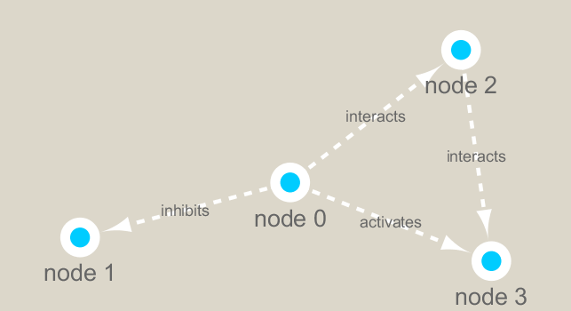

```{r setup, include=FALSE}
knitr::opts_chunk$set(echo = TRUE)
```

## Setup the R packages that we need.

```{r}
# if (!requireNamespace("BiocManager", quietly = TRUE))
#    install.packages("BiocManager")
#BiocManager::install("RCy3")

#install.packages("igraph")

#install.packages("RColorBrewer")
```

```{r}
library(RCy3)
library(igraph)
library(RColorBrewer)
```

Can we talk to Cytoscape from R?

```{r}
library(RCy3)

# Test the connection to Cytoscape.
cytoscapePing()
```

```{r}
# Check the version
cytoscapeVersionInfo()
```

We can test things further by making a little sample network and sending it to Cytoscape.

```{r}
g <- makeSimpleIgraph()
createNetworkFromIgraph(g,"myGraph")
```

```{r}
setVisualStyle("Marquee")
```

Let's save an image from Cytoscape and include it in this document.

```{r}
fig <- exportImage(filename="demo_marquee", type="png", height=350)


```

```{r}
plot(g)
```

## Read the metagenomics data.

Read our input data for this session:

```{r}
## scripts for processing located in "inst/data-raw/"
prok_vir_cor <- read.delim("virus_prok_cor_abundant.tsv", stringsAsFactors = FALSE)

## Have a peak at the first 6 rows
head(prok_vir_cor)
```

```{r}
g2 <- graph.data.frame(prok_vir_cor, directed = FALSE)
```

```{r}
class(g2)
```

```{r}
plot(g2)
```

The labels are enormous and the nodes are too huge! Clean this up.

```{r}
plot(g2, vertex.size=3, vertex.label=NA)
```

Now we can see that there are distinct communities to examine!

```{r}
createNetworkFromIgraph(g2,"myIgraph")
```

## Network community detection

Community structure detection algorithms try to find dense sub-graphs within larger network graphs (i.e. clusters of well connected nodes that are densely connected themselves but sparsely connected to other nodes outside the cluster) . Here we use the classic Girvan & Newman betweenness clustering method. The igraph package has lots of different community detection algorithms (i.e. different methods for finding communities).

```{r}
cb <- cluster_edge_betweenness(g2)
```

```{r}
cb
```

```{r}
plot(cb, y=g2, vertex.label=NA,  vertex.size=3)
```

## Centrality analysis

Centrality gives an estimation on how important a node or edge is for the connectivity (or the information flow) of a network. It is a particularly useful parameter in signaling networks and it is often used when trying to find drug targets f# Make a size vector btwn 2 and 20 for node plotting size

v.size <- BBmisc::normalize(pr$vector, range=c(2,20), method="range")
plot(g, vertex.size=v.size, vertex.label=NA)or example.

Centrality analysis often aims to answer the following question: Which nodes are the most important and why?

One centrality method that you can often find in publications is the Google PageRank score. For the explanation of the PageRank algorithm, see the following webpage: http://infolab.stanford.edu/~backrub/google.html

```{r}
pr <- page_rank(g2)
head(pr$vector)
```

```{r}
# Make a size vector btwn 2 and 20 for node plotting size

v.size <- BBmisc::normalize(pr$vector, range=c(2,20), method="range")
plot(g2, vertex.size=v.size, vertex.label=NA)
```

