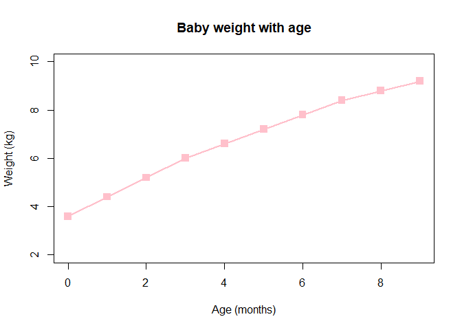
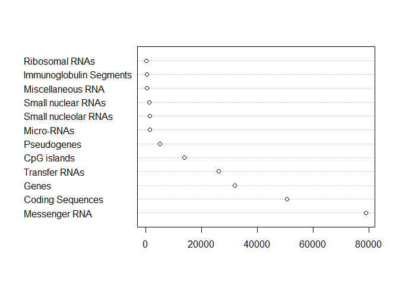
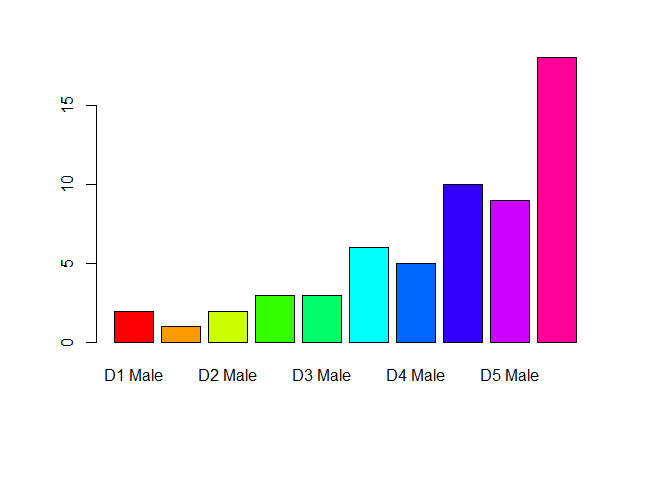
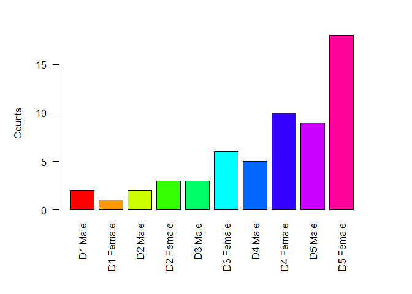
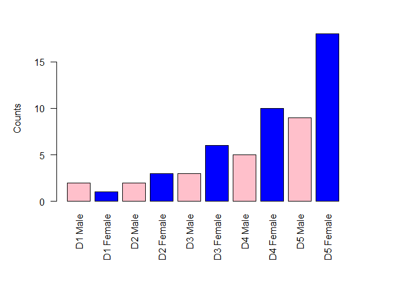

Class 5: Data visualization and graphics in R
================
Tiffany Luong
1/24/2020

``` r
#Class 5
#Data visualization and graphics in R

#GRAPH 1: practice plot
plot(1:5, col="blue", typ="o")
```

<!-- -->

``` r
#following the lecture exercise

#read table for weight_chart
weight <- read.table("bimm143_05_rstats/weight_chart.txt", header = TRUE)

#GRAPH 2: HOW TO MAKE A LINE PLOT
#change the scatterplot produced to a line plot
#pch = point type
#cex = point size
#lwd = line density
#ylim = limit the y-axis
#xlab = x-axis label
#ylab = y-axis label
#main = title
#col = pink
plot(weight$Age, weight$Weight, typ="o", pch=15, cex=1.5, lwd=2, ylim=c(2,10), xlab = "Age (months)", ylab = "Weight (kg)", main = "Baby weight with age", col="pink")
```

<!-- -->

``` r
#sep="\t" SEPARATE BY TAB!!!! to include the row names
mouse <- read.table("bimm143_05_rstats/feature_counts.txt", header = TRUE, sep="\t")

#GRAPH 3: DotChart(X, labels)
dotchart(mouse$Count, labels = mouse$Feature)
```

<!-- -->

``` r
#GRAPH 4: barplot basic
barplot(mouse$Count)
```

<!-- -->

``` r
#make changes
#PAR (bottom, left, top, right)
par(mar=c(4, 12, 3, 5))

#GRAPH 5: BARPLOT pretty
barplot(mouse$Count, horiz= TRUE, names.arg = mouse$Feature, main = "# of features in the mouse GRCm38 genome", las=1, xlim=c(0,80000), col = "lightblue")
```

<!-- -->

``` r
#Providing Color Vectors!
mfcount <- read.delim("bimm143_05_rstats/male_female_counts.txt")

#change the margins!
par(mar=c(7,5,3,4))

#GRAPH 6: hard code the number of rainbows
barplot(mfcount$Count, names.arg = mfcount$Sample, col=rainbow(10))
```

<!-- -->

``` r
#GRAPH 7: code the number of rainbows by 'nrows'
barplot(mfcount$Count, names.arg = mfcount$Sample, col=rainbow(nrow(mfcount)), las=2, ylab ="Counts")
```

<!-- -->

``` r
#GRAPH 8: code by every other color (list them)
barplot(mfcount$Count, names.arg = mfcount$Sample, col=c("pink", "blue"), las=2, ylab ="Counts")
```

<!-- -->
