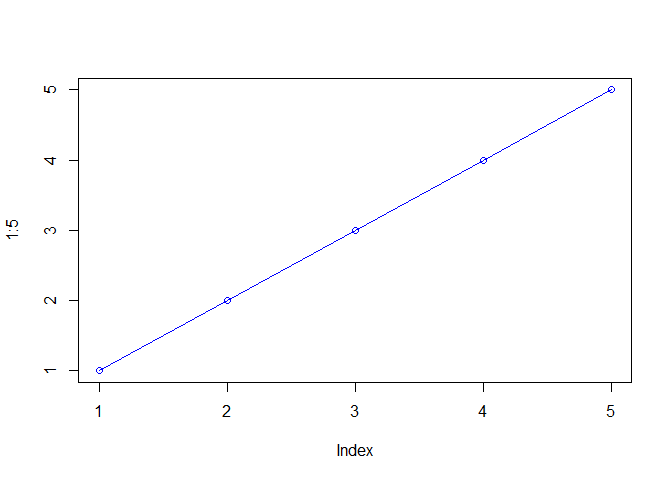
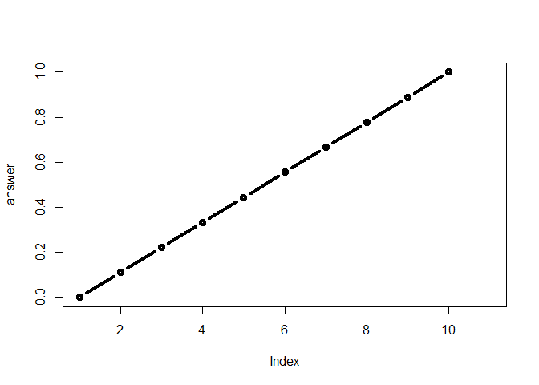

Class 6: R functions
================
Tiffany Luong
1/24/2020

## This is a level 2 heading

This is **regular** old *text*\!

and a list of stuff

  - thing one
  - thing two
  - and another thing

<!-- end list -->

``` r
plot(1:5, col="blue", type="o")
```

<!-- -->

### Type ctrl+alt+i to shortcut add an “R Chunk”:

Let’s insert a code chunk with the shortcut `CTRL-ALT-i`:

``` r
x <- c(1:10)
x
```

    ##  [1]  1  2  3  4  5  6  7  8  9 10

Here is my analysis of your new data. It looks ok… the mean of your data
is 5.5.

## More on reading input files

We will use the read.table() function again,

No good,

``` r
read.table("test1.txt")
```

    ##               V1
    ## 1 Col1,Col2,Col3
    ## 2          1,2,3
    ## 3          4,5,6
    ## 4          7,8,9
    ## 5          a,b,c

doesn’t work,

``` r
x <- read.table("test1.txt")
```

Test1: This does it\!

``` r
read.table("test1.txt", header = TRUE, sep =",")
```

    ##   Col1 Col2 Col3
    ## 1    1    2    3
    ## 2    4    5    6
    ## 3    7    8    9
    ## 4    a    b    c

Alternatively, read.csv to do this without argument.

``` r
read.csv("test1.txt")
```

    ##   Col1 Col2 Col3
    ## 1    1    2    3
    ## 2    4    5    6
    ## 3    7    8    9
    ## 4    a    b    c

Test2: Here’s another example.

``` r
read.table("test2.txt", header = TRUE, sep = "$")
```

    ##   Col1 Col2 Col3
    ## 1    1    2    3
    ## 2    4    5    6
    ## 3    7    8    9
    ## 4    a    b    c

Finally, Test3:

``` r
read.table("test3.txt", row.names = 1)
```

    ##   V2 V3
    ## 1  6  a
    ## 2  7  b
    ## 3  8  c
    ## 4  9  d
    ## 5 10  e

**int** stands for “integer”. **fctr** stands for “factor”.

read.delim() is coded by read.table() read.table is the parent of all of
them.

(If you type in just read.delim you see the structure calls the
read.table function and argues with it.)

## Our first function

This is an example function named `add` with input `x` and `y`:

``` r
add <- function(x, y=1) {
  #Sum the input x and y
  x + y
}
```

Let’s try using it\!

``` r
add(x=c(1,6,2), y=4)
```

    ## [1]  5 10  6

``` r
add(1,6)
```

    ## [1] 7

## In class lab exercise:

Section 1A

``` r
# (A. Can you improve this analysis code?
df <- data.frame(a=1:10, b=seq(200,400,length=10),c=11:20,d=NA)
df$a <- (df$a - min(df$a)) / (max(df$a) - min(df$a))
df$b <- (df$b - min(df$a)) / (max(df$b) - min(df$b))
df$c <- (df$c - min(df$c)) / (max(df$c) - min(df$c))
df$d <- (df$d - min(df$d)) / (max(df$a) - min(df$d))
```

Let’s make this into the **rescale** function\! (This will also make
this more reusable in the future\!)

Let’s reduce it down– use a vector named x.

``` r
#x <-(x- min(x) / max(x) - min(x))
```

Note how -min(x) is duplicated twice?

``` r
#xmin <- min(x)

#x <- (x - xmin)/max(x) - xmin
```

Or just use range\!

``` r
x<- c(10,4,22,6)
min(x)
```

    ## [1] 4

``` r
max(x)
```

    ## [1] 22

``` r
range (x)
```

    ## [1]  4 22

``` r
rng <- range(x)
x <- (x - rng[1])/(rng[2] - rng[1])
```

Rescale the data to lie between 0 and 10:

``` r
rescale <- function(x) {
  rng <-range(x)
  (x-rng[1])/(rng[2]-rng[1])
}
```

Let’s test it:

``` r
rescale(c(1:10, 30, 100))
```

    ##  [1] 0.00000000 0.01010101 0.02020202 0.03030303 0.04040404 0.05050505
    ##  [7] 0.06060606 0.07070707 0.08080808 0.09090909 0.29292929 1.00000000

What if we break it?

``` r
rescale(c(1:10, NA))
```

    ##  [1] NA NA NA NA NA NA NA NA NA NA NA

How do you troubleshoot? Start from the top:

``` r
x<- c(1:10, NA)

rng <- range(x, na.rm= TRUE)

rng
```

    ## [1]  1 10

There we go\!

``` r
rescale2 <- function(x) {
  rng <-range(x, na.rm= TRUE)
  (x-rng[1])/(rng[2]-rng[1])
}
```

Now we repeat what broke it…

``` r
rescale2(c(1:10, NA))
```

    ##  [1] 0.0000000 0.1111111 0.2222222 0.3333333 0.4444444 0.5555556 0.6666667
    ##  [8] 0.7777778 0.8888889 1.0000000        NA

Now our code is more robust\!

``` r
rescale2(c(2, 3, NA, 6))
```

    ## [1] 0.00 0.25   NA 1.00

Let’s make this more complicated:

``` r
rescale3 <- function(x, na.rm=TRUE, plot=FALSE) {
if(na.rm) {
rng <-range(x, na.rm=na.rm)
} else {
rng <-range(x)
}
print("Hello")
answer <- (x - rng[1]) / (rng[2] - rng[1])

print("is it me you are looking for?")
if(plot) {
  print("Please don't sing again!")
plot(answer, typ="b", lwd=4)
}
print("I can see it in ...")
}
```

``` r
rescale3(x, plot= TRUE)
```

    ## [1] "Hello"
    ## [1] "is it me you are looking for?"
    ## [1] "Please don't sing again!"

<!-- -->

    ## [1] "I can see it in ..."

## Working with bio3d package

To use the functions from any package installed, we use the `library()`
to load it\!

``` r
library(bio3d)
```

### This is a level 3 heading

This is an R Markdown document. Markdown is a simple formatting syntax
for authoring HTML, PDF, and MS Word documents. For more details on
using R Markdown see <http://rmarkdown.rstudio.com>.

When you click the **Knit** button a document will be generated that
includes both content as well as the output of any embedded R code
chunks within the document. You can embed an R code chunk like this:

``` r
summary(cars)
```

    ##      speed           dist       
    ##  Min.   : 4.0   Min.   :  2.00  
    ##  1st Qu.:12.0   1st Qu.: 26.00  
    ##  Median :15.0   Median : 36.00  
    ##  Mean   :15.4   Mean   : 42.98  
    ##  3rd Qu.:19.0   3rd Qu.: 56.00  
    ##  Max.   :25.0   Max.   :120.00

## Including Plots

You can also embed plots, for example:

<!-- -->

Note that the `echo = FALSE` parameter was added to the code chunk to
prevent printing of the R code that generated the plot.
