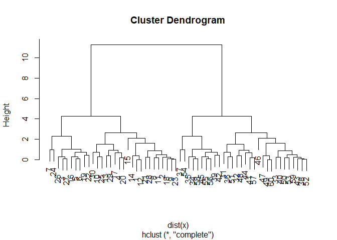
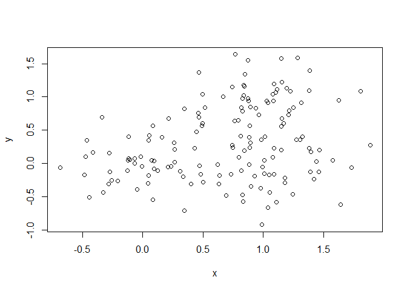
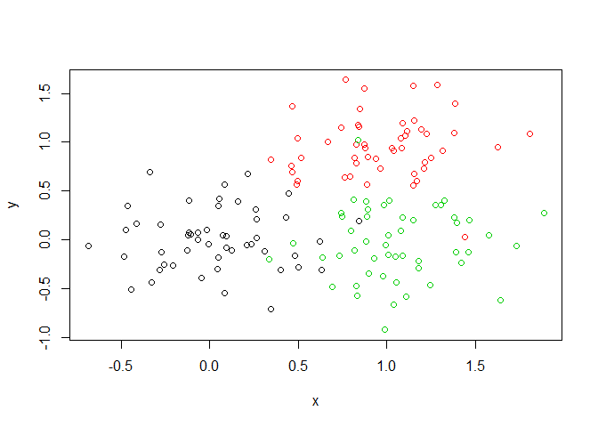
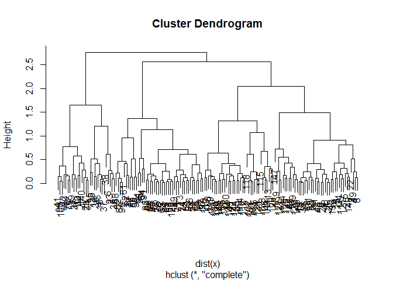

Hands on with Principal Component Analysis (PCA)
================
Tiffany Luong
2/5/2020

<https://bioboot.github.io/bggn213_W20/class-material/lab-8-bggn213.html>

## K-means clustering

Let’s try the `kmeans()` function in R to cluster some made-up example
data.

``` r
# Generate some example data for clustering

#30 points with a mean of -3. The second rnorm generates 30 points with a mean of +3.

tmp <- c(rnorm(30,-3), rnorm(30,3))

x <- cbind(x=tmp, y=rev(tmp))

plot(x)
```

<!-- -->

Use the kmeans() function settkming k to 2 and nstart = 20.

``` r
km <- kmeans(x, centers = 2, nstart = 20)
```

Inspect/print the results

``` r
km
```

    ## K-means clustering with 2 clusters of sizes 30, 30
    ## 
    ## Cluster means:
    ##           x         y
    ## 1 -2.989195  2.839118
    ## 2  2.839118 -2.989195
    ## 
    ## Clustering vector:
    ##  [1] 1 1 1 1 1 1 1 1 1 1 1 1 1 1 1 1 1 1 1 1 1 1 1 1 1 1 1 1 1 1 2 2 2 2 2 2 2 2
    ## [39] 2 2 2 2 2 2 2 2 2 2 2 2 2 2 2 2 2 2 2 2 2 2
    ## 
    ## Within cluster sum of squares by cluster:
    ## [1] 40.50539 40.50539
    ##  (between_SS / total_SS =  92.6 %)
    ## 
    ## Available components:
    ## 
    ## [1] "cluster"      "centers"      "totss"        "withinss"     "tot.withinss"
    ## [6] "betweenss"    "size"         "iter"         "ifault"

What is in the output object `km`? I can use the `attributes()` function
to find this info. :-)

``` r
attributes(km)
```

    ## $names
    ## [1] "cluster"      "centers"      "totss"        "withinss"     "tot.withinss"
    ## [6] "betweenss"    "size"         "iter"         "ifault"      
    ## 
    ## $class
    ## [1] "kmeans"

Q. How many points are in each cluster?

``` r
km$size
```

    ## [1] 30 30

Q. What ‘component’ of your result object details - cluster size? see
above.

  - cluster assignment/membership?

<!-- end list -->

``` r
km$cluster
```

    ##  [1] 1 1 1 1 1 1 1 1 1 1 1 1 1 1 1 1 1 1 1 1 1 1 1 1 1 1 1 1 1 1 2 2 2 2 2 2 2 2
    ## [39] 2 2 2 2 2 2 2 2 2 2 2 2 2 2 2 2 2 2 2 2 2 2

Let’s check how many 2’s and 1’s are in this vector with the `table()`
function.

``` r
table(km$cluster)
```

    ## 
    ##  1  2 
    ## 30 30

  - cluster center?

<!-- end list -->

``` r
km$centers
```

    ##           x         y
    ## 1 -2.989195  2.839118
    ## 2  2.839118 -2.989195

Plot x colored by the kmeans cluster assignment and add cluster centers
as blue points.

``` r
#c(rep("red", 30), rep("blue",30))

plot(x, col=km$cluster)
points(km$centers, col="blue", pch=16, cex=3)
```

<!-- -->

## Hierarchical clustering in R

The `hclust()` function is the main Hierarchical clustering method in R
and it **must** be passed a *distance matrix* as input, not your raw
data\!

``` r
hc <- hclust(dist(x))

hc
```

    ## 
    ## Call:
    ## hclust(d = dist(x))
    ## 
    ## Cluster method   : complete 
    ## Distance         : euclidean 
    ## Number of objects: 60

``` r
plot(hc)
```

<!-- -->

``` r
plot(hc)
abline(h=6, col="red", lty=2)
abline(h=3.5, col="blue", lty=2)
```

<!-- -->

``` r
cutree(hc, h=6)
```

    ##  [1] 1 1 1 1 1 1 1 1 1 1 1 1 1 1 1 1 1 1 1 1 1 1 1 1 1 1 1 1 1 1 2 2 2 2 2 2 2 2
    ## [39] 2 2 2 2 2 2 2 2 2 2 2 2 2 2 2 2 2 2 2 2 2 2

``` r
table(cutree(hc, h=3.5))
```

    ## 
    ##  1  2  3  4 
    ## 20 10 20 10

You can also ask `cutree()` for the `k` number of groups that you want.

``` r
cutree(hc, k=5)
```

    ##  [1] 1 1 2 1 2 2 2 1 1 1 1 1 1 1 1 2 1 1 2 1 1 2 1 2 1 2 2 1 1 1 3 3 4 5 5 3 5 4
    ## [39] 5 4 3 5 4 3 5 4 4 3 4 4 3 4 4 5 5 5 3 5 4 4

## Data clustering.

Step 1. Generate some example data for clustering

``` r
x <- rbind(
matrix(rnorm(100, mean=0, sd=0.3), ncol = 2), # c1
matrix(rnorm(100, mean=1, sd=0.3), ncol = 2), # c2
matrix(c(rnorm(50, mean=1, sd=0.3), # c3
rnorm(50, mean=0, sd=0.3)), ncol = 2))
colnames(x) <- c("x", "y")
```

Step 2. Plot the data without clustering

``` r
plot(x)
```

<!-- -->

Step 3. Generate colors for known clusters

``` r
# (just so we can compare to hclust results)
col <- as.factor( rep(c("c1","c2","c3"), each=50) )
plot(x, col=col)
```

<!-- -->

Your Turn\! Q. Use the dist(), hclust(), plot() and cutree() functions
to return 2 and 3 clusters

``` r
hc <- hclust(dist(x))

plot(hc)
```

<!-- -->

``` r
grps3 <- cutree(hc, k=3)

grps3
```

    ##   [1] 1 2 2 1 1 2 2 1 1 2 1 2 1 1 2 1 2 2 1 1 2 1 2 1 1 1 1 2 1 2 1 1 1 2 2 1 2
    ##  [38] 2 2 2 2 1 1 2 1 2 2 1 1 1 3 3 3 3 3 3 3 3 3 1 3 3 3 3 3 3 3 3 3 3 3 2 3 3
    ##  [75] 3 2 3 3 2 2 3 3 3 3 3 3 3 3 3 3 3 3 3 3 3 3 3 2 3 2 1 1 1 1 1 1 1 1 1 1 1
    ## [112] 1 1 1 1 1 1 1 1 1 1 1 3 1 1 1 1 1 1 1 1 1 1 1 1 1 1 1 1 1 1 1 1 1 1 1 1 1
    ## [149] 1 1

``` r
table(grps3)
```

    ## grps3
    ##  1  2  3 
    ## 77 29 44

Q. How does this compare to your known ‘col’ groups?

``` r
plot(x, col=grps3)
```

<!-- -->

We can use a cross table to look at the data we just generated. Cluster
from k=3 compared to the original data “col”. Think of it as looking at
“true positives” vs. “false positives”.

``` r
table(grps3, col)
```

    ##      col
    ## grps3 c1 c2 c3
    ##     1 27  1 49
    ##     2 23  6  0
    ##     3  0 43  1

## Principal Component Analysis (PCA)

Thr main function in R for PCA is called `prcomp()`. Here we will use
PCA to examine the funny food that folks eat in the UK and N. Ireland.

Import the CSV file first:

``` r
x <- read.csv("UK_foods.csv", row.names = 1)

x
```

    ##                     England Wales Scotland N.Ireland
    ## Cheese                  105   103      103        66
    ## Carcass_meat            245   227      242       267
    ## Other_meat              685   803      750       586
    ## Fish                    147   160      122        93
    ## Fats_and_oils           193   235      184       209
    ## Sugars                  156   175      147       139
    ## Fresh_potatoes          720   874      566      1033
    ## Fresh_Veg               253   265      171       143
    ## Other_Veg               488   570      418       355
    ## Processed_potatoes      198   203      220       187
    ## Processed_Veg           360   365      337       334
    ## Fresh_fruit            1102  1137      957       674
    ## Cereals                1472  1582     1462      1494
    ## Beverages                57    73       53        47
    ## Soft_drinks            1374  1256     1572      1506
    ## Alcoholic_drinks        375   475      458       135
    ## Confectionery            54    64       62        41

You can visualize differences like so: Changing beside to “F” can make
it a stacked graph instead.

``` r
barplot(as.matrix(x), beside=T, col=rainbow(nrow(x)))
```

<!-- -->

``` r
pairs(x, col=rainbow(10), pch=16)
```

<!-- -->

# PCA to the rescue\!

``` r
pca <- prcomp(t(x))
summary(pca)
```

    ## Importance of components:
    ##                             PC1      PC2      PC3       PC4
    ## Standard deviation     324.1502 212.7478 73.87622 4.189e-14
    ## Proportion of Variance   0.6744   0.2905  0.03503 0.000e+00
    ## Cumulative Proportion    0.6744   0.9650  1.00000 1.000e+00

Think of PCA as a filter for your data\! Now figure out how to plot it:

``` r
attributes(pca)
```

    ## $names
    ## [1] "sdev"     "rotation" "center"   "scale"    "x"       
    ## 
    ## $class
    ## [1] "prcomp"

``` r
# Plot PC1 vs PC2
plot(pca$x[,1], pca$x[,2], xlab="PC1", ylab="PC2", xlim=c(-270,500))
text(pca$x[,1], pca$x[,2], colnames(x), col=c("black", "red", "blue", "darkgreen"))
```

<!-- -->

``` r
## Lets focus on PC1 as it accounts for > 90% of variance 
par(mar=c(10, 3, 0.35, 0))
barplot( pca$rotation[,1], las=2 )
```

<!-- -->
